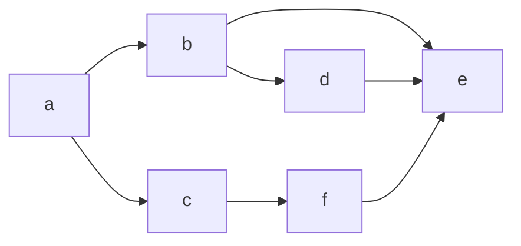

---  
share: true  
---   
{:.medo}  
[Início](Início)  
<span class="x">[Início](Início)</span>  
  
<div class="lis">  
[Início](Início)  
</div>  
  
  
  
  
- [Início](Início|in) { .x }  
-   
- medo  
<div class="medo"><ul>  
<li>a</li>  
<li>b</li>  
<li>c</li></ul>  
</div>  
  
---  

  
  
  
```  
medo  
```  
  
  
  
```ad-quote  
medo?  
medo  
```  
  
```quote  
medo  
medo  
```  
  
```quote medo  
medo  
medo  
```  
medo  
medo  
```[quote]  
medo  
medo  
```  
  
```[!quote]  
medo  
medo  
```  
  
> [!quote] medo?  
> > medo?  
> > medo  
> > medo  
  
```ad-quote medo?  
> medo  
> medo  
> medo  
```  
  
> medo?  
> medo  
> medo